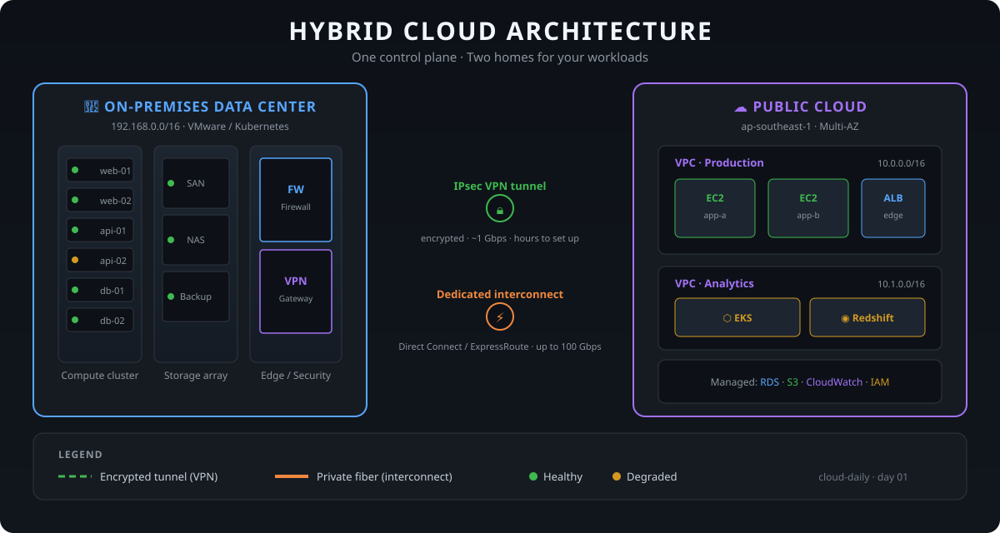

# ☁️ cloud-daily

A living journal of cloud engineering — one topic a day: deep-dives, architecture diagrams, real code, quizzes, and curated videos. No fluff, no boring walls of text.

**Start with today's entry: [Hybrid Cloud — The Complete, No-Boring Guide](daily/2026-10-08-hybrid-cloud/README.md)**.

## How this journal works

> [!NOTE]
> New entries drop daily. Each one follows the same playbook: concept → architecture → real code → quiz → video.

1. Pick a day from the index below.
2. Read the guide — diagrams first, text second.
3. Try the code snippet or mini-lab.
4. Test yourself with the 5-minute quiz.

## 📅 Index

| Day | Date | Topic | Focus |
|-----|------|-------|-------|
| 01 | 2026-10-08 | [Hybrid Cloud](daily/2026-10-08-hybrid-cloud/README.md) | Architecture · Networking · Terraform |

_More days coming. The cloud never sleeps._
