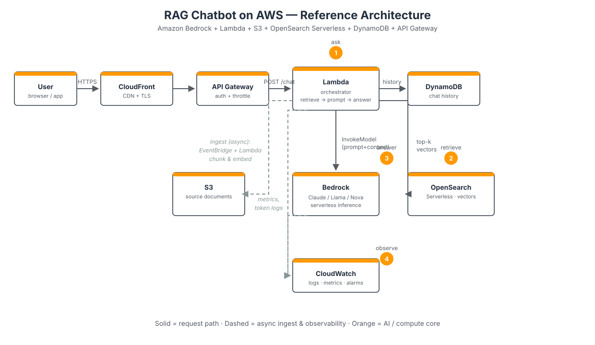

# 🧠 AI Architecture on AWS — From Prompt to Production


> [!TIP]
> **TL;DR** — AWS gives you three doors into AI: **use** a foundation model as-is (Bedrock), **customize** one (SageMaker), or **grab** a ready-made API (Rekognition, Transcribe, …). The real engineering skill isn't picking the model — it's wiring it into an architecture with the "boring" services (S3, Lambda, queues) so it scales, stays cheap, and doesn't leak your data.



## 1. The AWS AI menu — pick your door

Most teams overthink the model and underthink the plumbing. Start here:

| Door | Service | What it is | Reach for it when… |
|---|---|---|---|
| 🚪 **Use** | **Amazon Bedrock** | Serverless API to foundation models (Claude, Llama, Mistral, Titan, Nova) | You want LLM power with zero infra. Pay per token, scale to zero. |
| 🛠️ **Customize** | **Amazon SageMaker** | Train, fine-tune & host your own models | You need full control, custom training, or VPC-only data |
| ⚡ **Grab** | **AI services** | Single-purpose APIs: Rekognition, Transcribe, Polly, Comprehend, Textract, Personalize | The task is well-defined (OCR, speech-to-text, image labels…) |
| 🧰 **Support crew** | S3 · Lambda · API Gateway · SQS · EventBridge · Step Functions · DynamoDB · OpenSearch | The boring stuff that makes AI production-ready | Always. AI without plumbing is a demo, not a product. |

> [!NOTE]
> Rule of thumb: **start at the top of the table and only move down when you must.** A Bedrock call behind API Gateway beats a self-hosted GPU cluster you have to babysit at 3 AM.

## 2. Pattern 1 — RAG chatbot (the classic combo)

Retrieval-Augmented Generation is the most deployed AI architecture on AWS for one reason: it grounds the model in *your* data without retraining anything.

**How the combo works** (see diagram above):

1. **Ingest** — PDFs/docs land in **S3** → an **EventBridge** rule fires → **Lambda** chunks text and writes embeddings to **OpenSearch Serverless** (vector index).
2. **Ask** — User hits **API Gateway** → **Lambda** (orchestrator) pulls top-k chunks from OpenSearch *and* recent chat history from **DynamoDB**.
3. **Answer** — Lambda calls **Bedrock** (e.g. Claude) with context + question → streams the answer back.
4. **Observe** — **CloudWatch** logs tokens, latency, and errors. Set a billing alarm before your first demo — future you says thanks.

Why this combo wins: every piece scales to zero except OpenSearch (use the serverless flavor), IAM keeps Bedrock scoped per function, and swapping the model is a one-line change.

## 3. Pattern 2 — Async document intelligence pipeline

Not everything needs a chatbot. For "process these 10,000 invoices":

```
S3 (upload) → EventBridge → Lambda → Textract (OCR)
    → Comprehend (entities/sentiment) → DynamoDB → SNS (notify)
```

- **Event-driven, not scheduled.** New file = new execution. No cron, no idle workers.
- **Fan-out with SQS** between stages if any step is slow or flaky — Textract async jobs can take minutes.
- **Dead-letter queues** on every Lambda. AI APIs fail in creative ways; don't lose the document.

## 4. Pattern 3 — Real-time inference endpoint

When milliseconds matter (fraud scoring, recommendations):

- **SageMaker endpoint** with autoscaling (scale on `InvocationsPerInstance`, not CPU).
- **API Gateway** in front for auth, throttling, and usage plans.
- **Shadow variant** for new model versions — route 5% of traffic, compare, then promote. Blue/green for brains.

> [!WARNING]
> SageMaker endpoints bill per instance-hour **even at zero traffic**. For spiky workloads, prefer **SageMaker Serverless Inference** or an async endpoint instead.

## 5. The unsexy parts that decide success

- **IAM least privilege** — Bedrock `InvokeModel` scoped to specific model ARNs per Lambda role. One shared "AI admin" role is how incidents happen.
- **Guardrails** — Bedrock Guardrails for PII redaction, topic filters, and jailbreak detection. Cheap insurance.
- **Cost controls** — Bedrock on-demand per token vs. **Provisioned Throughput** when volume is predictable (can cut unit cost ~50%+). Set **AWS Budgets** alerts on day one.
- **Data residency** — Keep embeddings and prompts in-region. Cross-region inference exists, but know where your tokens travel.
- **Observability** — Log prompts *and* token counts (not just latency). Your two biggest production surprises will be cost spikes and slow cold prompts.

## 6. Mini-lab — try it in 5 minutes

The [`bedrock_rag.py`](./bedrock_rag.py) sample shows the core loop of Pattern 1: retrieve context from a knowledge base, then call Bedrock with it. Needs `boto3` and AWS credentials with `bedrock:InvokeModel`:

```bash
pip install boto3
python bedrock_rag.py --kb-id YOUR_KB_ID --query "What is our refund policy?"
```

No KB yet? Comment out the retrieve step and just run the Bedrock call — you'll still see the full request/response shape.

## 7. Test yourself — [5-minute quiz](./quiz.md)

Covers: when to pick Bedrock vs SageMaker vs AI services, RAG data flow, cost traps, and IAM scoping. Answers included (no peeking).

## 8. Keep learning

- 📖 [Amazon Bedrock — official docs & pricing](https://aws.amazon.com/bedrock/) — start with the model catalog
- 🎥 Search *"AWS re:Invent Bedrock"* on YouTube for the yearly deep-dives — the architecture talks are gold

---

*Day 02 of the cloud-daily journal. Tomorrow: another building block. The cloud never sleeps.* ☁️
